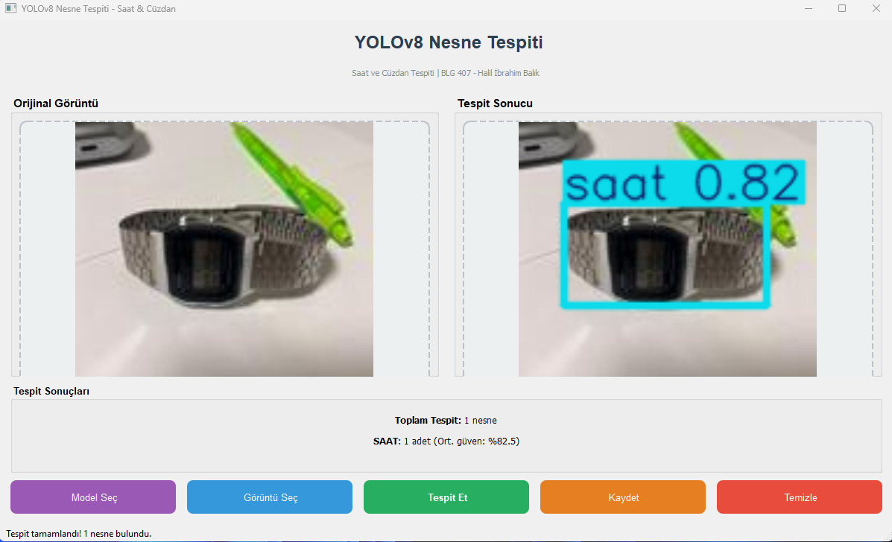

# YOLOv8 ile Nesne Tespiti - Saat ve Cüzdan

Bu proje, BLG 407 Makine Öğrenmesi dersi 2. Proje Ödevi kapsamında geliştirilmiştir. Kendi oluşturduğum görüntü veri seti üzerinde YOLOv8 modeli eğitilmiş ve PyQt5 tabanlı masaüstü uygulaması geliştirilmiştir.

## Proje Bilgileri

| | |
|---|---|
| Ad Soyad | Halil İbrahim Balık |
| Okul Numarası | 2212721046 |
| Ders | BLG 407 - Makine Öğrenmesi |
| Dönem | 2025-2026 Güz |

## Veri Seti

Projede kullanılan veri seti tamamen özgün olup, kendi çektiğim görüntülerden oluşmaktadır. Etiketleme işlemi Roboflow platformu kullanılarak YOLOv8 formatında yapılmıştır.

| Özellik | Değer |
|---------|-------|
| Sınıf Sayısı | 2 |
| Sınıflar | cuzdan, saat |
| Toplam Görüntü | 209 |
| Etiketleme Aracı | Roboflow |
| Format | YOLOv8 (txt) |

### Veri Seti Yapısı

```
dataset/
├── train/
│   ├── images/
│   └── labels/
├── valid/
│   ├── images/
│   └── labels/
├── test/
│   ├── images/
│   └── labels/
└── data.yaml
```

## Model Eğitimi

### YOLOv8 Hakkında

YOLO (You Only Look Once), gerçek zamanlı nesne tespiti için kullanılan state-of-the-art bir deep learning mimarisidir. YOLOv8, Ultralytics tarafından geliştirilen en güncel versiyondur ve önceki sürümlere göre daha yüksek doğruluk ve hız sunmaktadır.

### Model Özeti

| Özellik | Değer |
|---------|-------|
| Model | YOLOv8n (Nano) |
| Katman Sayısı | 72 |
| Parametre Sayısı | 3,006,038 |
| GFLOPs | 8.1 |

### Eğitim Parametreleri

| Parametre | Değer | Açıklama |
|-----------|-------|----------|
| Model | YOLOv8n | Nano versiyon (hızlı, hafif) |
| Epochs | 100 | Maksimum eğitim iterasyonu |
| Image Size | 640 | Girdi görüntü boyutu |
| Batch Size | 16 | Mini-batch boyutu |
| Patience | 20 | Early stopping sabır değeri |
| Optimizer | SGD | Varsayılan optimizer |

### Eğitim Sonuçları

| Sınıf | Görüntü | Örnek | Precision | Recall | mAP50 | mAP50-95 |
|-------|---------|-------|-----------|--------|-------|----------|
| **Tüm** | 42 | 46 | 0.924 | 0.83 | 0.865 | 0.721 |
| cuzdan | 22 | 22 | 0.95 | 0.869 | 0.914 | 0.731 |
| saat | 20 | 24 | 0.898 | 0.792 | 0.816 | 0.711 |

### Sonuç Özeti

| Metrik | Değer |
|--------|-------|
| **mAP50** | **0.865 (%86.5)** |
| **mAP50-95** | **0.721 (%72.1)** |
| **Precision** | **0.924 (%92.4)** |
| **Recall** | **0.83 (%83.0)** |

### PyQt5 GUI Uygulaması




## Sonuçlar ve Değerlendirme

### Model Performansı

YOLOv8 modeli, saat ve cüzdan nesnelerini tespit edebilmektedir:

- **Precision %92.4:** Tespit edilen nesnelerin %92.4'ü doğru
- **Recall %83.0:** Gerçek nesnelerin %83'ü tespit edildi
- **mAP50 %86.5:** IoU=0.50 eşiğinde ortalama doğruluk
- **mAP50-95 %72.1:** Farklı IoU eşiklerinde ortalama doğruluk


## Kaynaklar

- [Ultralytics YOLOv8 Documentation](https://docs.ultralytics.com/)
- [Roboflow Platform](https://roboflow.com/)
- [PyQt5 Documentation](https://www.riverbankcomputing.com/static/Docs/PyQt5/)
- BLG 407 Ders Notları

## Lisans

Bu proje eğitim amaçlı geliştirilmiştir.

---
*Halil İbrahim Balık - 2212721046 - BLG 407 Makine Öğrenmesi*
